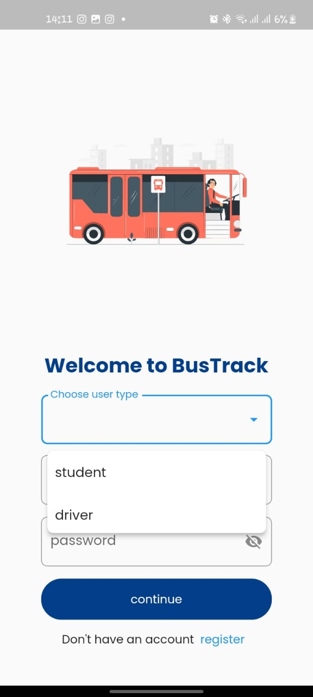
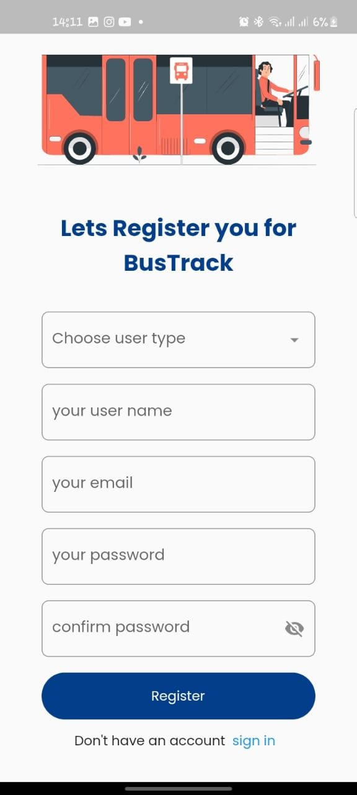
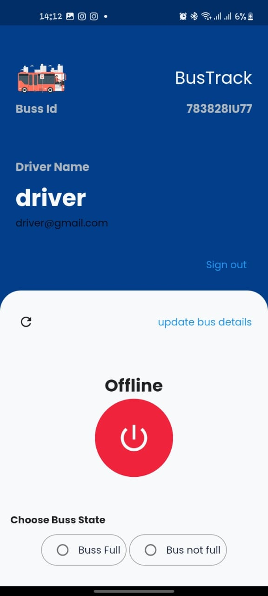
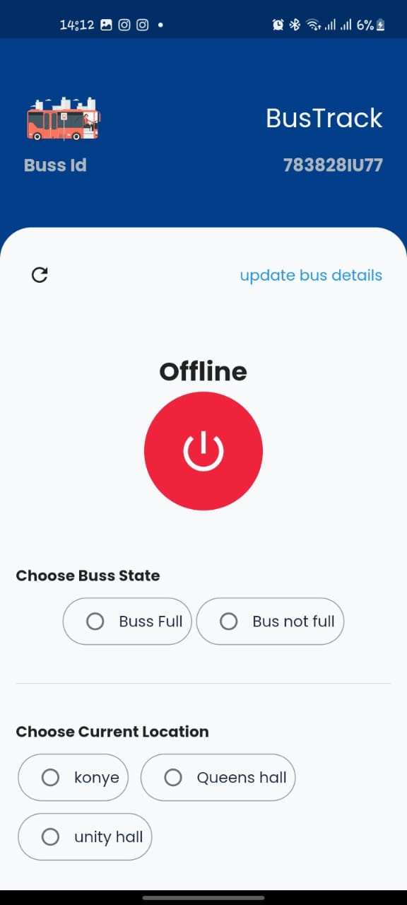

# BusTracking - Simple Mobile application for tracking school bus

This application was developed to help students find it easy to locate and wait for school buses.

## Packages leveraged
- get
- flutter_svg
- provider
- dropdown_textfield
- google_maps_flutter
- location
- cloud_firestore
- firebase_core
- firebase_auth
- permission_handler
- shared_preferences
- flutter_polyline_points
- flutter_config

## Sample UI images

### For a full list of list of images visit the [ ui images](ui_images)

